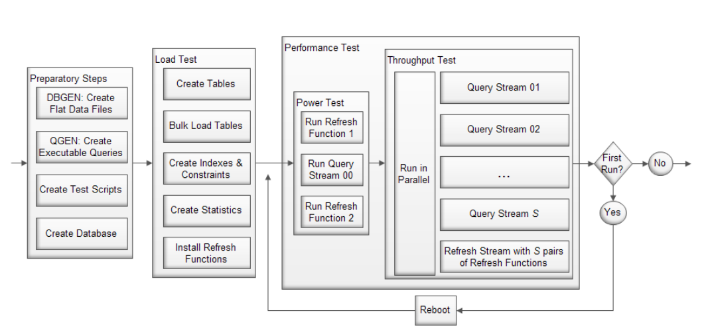
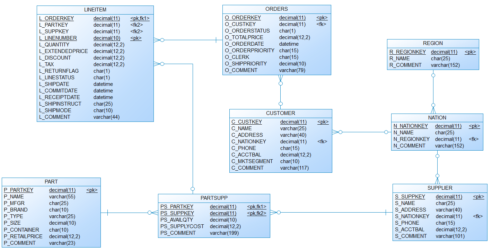

# tpch-pgsql
[](https://travis-ci.org/slavong/tpch-pgsql)

Implements the [TPCH benchmark](http://www.tpc.org/tpch/) for Postgres

### Requirements
* The benchmark requires TPC-H dbgen:
```
wget -q https://github.com/electrum/tpch-dbgen/archive/32f1c1b92d1664dba542e927d23d86ffa57aa253.zip -O tpch-dbgen.zip
unzip -q tpch-dbgen.zip && mv tpch-dbgen-32f1c1b92d1664dba542e927d23d86ffa57aa253 tpch-dbgen && rm tpch-dbgen.zip
```
* gcc

```
gcc --version
```

* python3

```
python3 --version
```

* python requirements

```
pip3 install -r requirements.txt
```

* some running instance of Postgres

```
pg_config --version
```

* if you want to run the database locally, please find below the commands for Ubuntu 14.04
```
sudo apt-get install -y postgresql postgresql-contrib

sudo -u postgres createuser tpch
sudo -u postgres createdb tpchdb

sudo -u postgres psql  << PSQL
ALTER USER tpch WITH ENCRYPTED PASSWORD '********';
GRANT ALL PRIVILEGES ON DATABASE tpchdb TO tpch;
\l
\q
PSQL
```

### Usage
There is a single python file that implements all phases of the benchmark.

```
usage: benchmark.py [-h] [-a HOST] [-p PORT] [-u USER] [-v [PASSWORD]]
                    [-d DATABASE] [-i DATA_DIR] [-q QUERY_ROOT] [-g DBGEN_DIR]
                    [-s SCALE] [-n NUM_STREAMS] [-b] [-r]
                    {prepare,load,query}

PGTPCH

positional arguments:
  {prepare,load,query}  Phase of PGTPCH to run.

optional arguments:
  -h, --help            show this help message and exit
  -a HOST, --host HOST  Address of host on which PostgreSQL instance runs;
                        default is localhost
  -p PORT, --port PORT  Port on which PostgreSQL instance runs; default is
                        5432
  -u USER, --user USER  User for the PostgreSQL instance; default is postgres
  -v [PASSWORD], --password [PASSWORD]
                        Password for the PostgreSQL instance; default is
                        test123
  -d DATABASE, --database DATABASE
                        Name of the database; default is tpch
  -i DATA_DIR, --data-dir DATA_DIR
                        Directory for generated data; default is ./data
  -q QUERY_ROOT, --query-root QUERY_ROOT
                        Directory for query files; default is ./query_root
  -g DBGEN_DIR, --dbgen-dir DBGEN_DIR
                        Directory containing tpch dbgen source; default is
                        ./tpch-dbgen
  -s SCALE, --scale SCALE
                        Size of the data generated; default is 1.0 = 1GB
  -n NUM_STREAMS, --num-streams NUM_STREAMS
                        Number of streams to run the throughput test with;
                        default is 0, i.e. based on scale factor SF
  -b, --verbose         Print more information to standard output
  -r, --read-only       Do not execute refresh functions during the query
                        phase, which allows for running it repeatedly

```

### Phases
* `prepare`  
The prepare phase builds TPC-H dbgen and querygen and creates the load and refresh (update/delete) files. 

* `load`  
The load phase cleans the database (if required), loads the tables into the database and 
creates indexes for querying. The results for this phase consist of the following metrics:
    * Schema creation time
    * Data loading time
    * Foreign key constraint and index creation time

* `query`  
The query phase is the actual performance test. Ir runs twice, with a reboot.
Each run consists of two parts:
    * Power test: This consists of sequential execution of the refresh functions and the query streams. It reports back with the execution times for:
        * refresh function 1
        * query execution time for the 22 TPC-H queries
        * refresh function 2
    * Throughput test: This consists of parallel execution of the query streams and the pairs of refresh functions

### TPC-H Process
The complete process for executing TPCH tests is illustrated in the following figure:


### Database Schema


### Known Issues
* Sometimes the data generation phase fails due to file permission issues. In such a scenario delete the data directory and all generated `.tbl` files inside your `tpch-dbgen` directory.

### References

* For notes on how to the TPCH-Benchmark works see the paper [iceis2012](https://github.com/Data-Science-Platform/tpch-pgsql/blob/master/iceis2012.pdf).
* For the TPC-H benchmark specification see [this document](http://www.tpc.org/tpc_documents_current_versions/pdf/tpc-h_v2.17.3.pdf).
